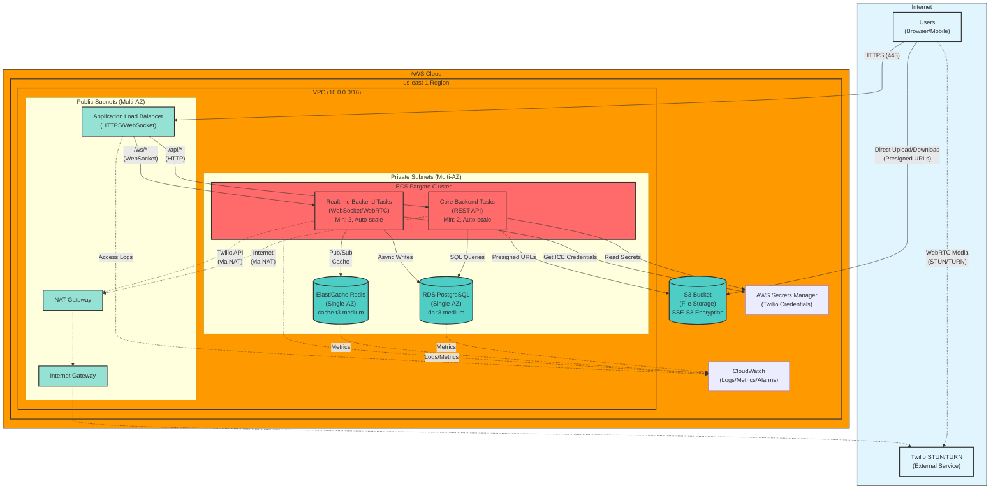
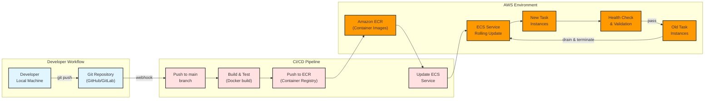

# Design Document: AWS Infrastructure for Real-time Collaboration Platform

## Overview

This document details the AWS infrastructure design for the Real-time Streaming & Collaboration platform MVP. The architecture uses serverless container orchestration (ECS Fargate) to host multi-tenant services with low-latency real-time messaging, WebRTC video/audio calling, and file sharing capabilities.

### Design Goals

- **Low Latency**: < 100ms for messaging, < 200ms for WebRTC signaling
- **Scalability**: Support 1000+ concurrent tenants and 10,000+ simultaneous connections
- **High Availability**: 99.9% uptime using multi-AZ deployment
- **Security**: Encryption in-transit and at-rest, network isolation, least-privilege access
- **Cost Optimization**: Appropriate sizing for MVP workload using t3.medium instances
- **Operational Simplicity**: Serverless container orchestration eliminates cluster management

### Key Technology Choices

- **Container Orchestration**: Amazon ECS with AWS Fargate (serverless, no EC2 management)
- **Load Balancing**: Application Load Balancer (supports HTTP/HTTPS + WebSocket)
- **Caching & Pub/Sub**: Amazon ElastiCache for Redis Single-AZ
- **Database**: Amazon RDS PostgreSQL Single-AZ
- **File Storage**: Amazon S3 with presigned URLs (no CDN for MVP)
- **STUN/TURN**: Twilio Network Traversal Service (SaaS, no self-hosting)
- **Monitoring**: Amazon CloudWatch for logs, metrics, and alarms


## Architecture Flows

### 1. User Access Flow (HTTP/WebSocket)

```
User Browser → Internet → ALB (Port 443 HTTPS) → [Path-based routing]
  │
  ├─ /api/* → Core Backend Target Group → ECS Tasks (Core Backend) → RDS PostgreSQL
  │                                      └─→ S3 (presigned URL generation)
  │
  └─ /ws/* → Realtime Backend Target Group → ECS Tasks (Realtime Backend) → Redis Pub/Sub
                [WebSocket upgrade, sticky sessions enabled]
```

**Key Points:**
- ALB terminates SSL/TLS using AWS Certificate Manager certificates
- Sticky sessions (1 hour duration) ensure WebSocket connections stay on same backend instance
- Path-based routing: `/api/*` → Core Backend, `/ws/*` → Realtime Backend
- Both backends deployed as ECS Fargate tasks across 2+ availability zones


### 2. Real-time Messaging Flow (WebSocket → Redis Pub/Sub)

```
User A (Browser)
  └─→ WebSocket (send message) → ALB → Realtime Backend Instance 1
       └─→ Redis PUBLISH to channel "workspace:123:messages"
            └─→ Redis broadcasts to all subscribers
                 ├─→ Realtime Backend Instance 1 (receives via SUBSCRIBE)
                 ├─→ Realtime Backend Instance 2 (receives via SUBSCRIBE)
                 └─→ Realtime Backend Instance N (receives via SUBSCRIBE)
                      └─→ Each instance pushes message via WebSocket to connected clients
                           └─→ User B, User C (receive message)

Asynchronously:
  Realtime Backend → Persists message to RDS PostgreSQL (non-blocking)
```

**Latency Budget:**
- User A → Realtime Backend: 10ms (WebSocket send)
- Realtime Backend → Redis PUBLISH: 10ms
- Redis → All subscribers: 5ms (Pub/Sub delivery)
- Realtime Backend → User B: 10ms (WebSocket push)
- **Total: < 100ms (target: 95th percentile)**


### 3. WebRTC Call Establishment Flow (with Twilio STUN/TURN)

```
User A (Caller)                                  User B (Callee)
  │                                                │
  ├─ 1. Initiate call                              │
  │   └─→ WebSocket → Realtime Backend             │
  │        └─→ GET Twilio ICE credentials (API)    │
  │        └─→ Return: STUN/TURN URLs + tokens     │
  │                                                 │
  ├─ 2. Create WebRTC offer                        │
  │   └─→ WebSocket (offer) → Realtime Backend     │
  │        └─→ Redis Pub/Sub (forward to User B)   │
  │             └─→ Realtime Backend → WebSocket ──┴─→ User B receives offer
  │                                                 │
  │                                                 ├─ 3. Create WebRTC answer
  │    User A receives answer ←── WebSocket ←──────┴─→ WebSocket (answer) → Realtime Backend
  │                             └─ Realtime Backend        └─→ Redis Pub/Sub (forward)
  │                                 └─ Redis Pub/Sub
  │
  ├─ 4. Exchange ICE candidates (bidirectional via WebSocket + Redis Pub/Sub)
  │
  ├─ 5. STUN binding request
  │   └─→ Twilio STUN Server (global.stun.twilio.com)
  │        └─→ Returns public IP:port mapping (< 50ms)
  │
  ├─ 6. Attempt peer-to-peer connection
  │   └─→ Direct UDP connection User A ↔ User B
  │
  └─ 7. If peer-to-peer fails (symmetric NAT/firewall):
      └─→ TURN relay via Twilio (global.turn.twilio.com)
           └─→ Media stream: User A → Twilio TURN → User B
```

**Key Points:**
- WebRTC signaling (offer/answer/ICE) flows through WebSocket → Redis Pub/Sub → WebSocket
- Twilio provides STUN/TURN as external SaaS (no self-hosting required)
- Twilio credentials generated server-side with 24-hour expiration
- Media streams use peer-to-peer when possible, TURN relay as fallback


### 4. File Upload/Download Flow (S3 Presigned URLs)

#### Upload Flow:
```
User Browser
  │
  ├─ 1. Request upload URL
  │   └─→ HTTPS → ALB → Core Backend
  │        └─→ Generate S3 presigned PUT URL (valid 15 minutes)
  │             └─→ Key pattern: "workspace-{id}/files/{uuid}-{filename}"
  │        └─→ Return presigned URL to browser
  │
  └─ 2. Upload file directly to S3
      └─→ HTTPS PUT → S3 Bucket (server-side encryption SSE-S3)
           └─→ CORS headers allow browser uploads
           └─→ S3 stores file in workspace-specific prefix
           └─→ S3 returns success → Browser
                └─→ Browser notifies Core Backend (POST /api/files/confirm)
                     └─→ Core Backend saves file metadata to RDS
```

#### Download Flow:
```
User Browser
  │
  ├─ 1. Request file access
  │   └─→ HTTPS → ALB → Core Backend
  │        └─→ Check authorization (workspace membership)
  │        └─→ Generate S3 presigned GET URL (valid 60 minutes)
  │        └─→ Return presigned URL to browser
  │
  └─ 2. Download file directly from S3
      └─→ HTTPS GET → S3 Bucket
           └─→ S3 returns file content with encryption in-transit
```

**Key Points:**
- No CDN for MVP (direct S3 access via presigned URLs)
- Backend controls authorization before generating URLs
- Files encrypted at rest (SSE-S3) and in transit (HTTPS)
- Lifecycle policy moves files > 90 days old to S3 Glacier


## Architecture Diagram




## Components and Interfaces

### 1. Amazon ECS Fargate (Container Orchestration)

**Purpose**: Serverless container orchestration for Core Backend and Realtime Backend services.

#### ECS Cluster Configuration:
```yaml
Cluster Name: realtime-collaboration-cluster
Launch Type: FARGATE
Capacity Providers: FARGATE, FARGATE_SPOT (for cost optimization)
```

#### Core Backend Task Definition:
```yaml
Family: core-backend-task
CPU: 512 (0.5 vCPU)
Memory: 1024 MB (1 GB)
Network Mode: awsvpc
Container Definition:
  - Name: core-backend
    Image: <ECR_REGISTRY>/core-backend:latest
    Port Mappings: 3000 (HTTP)
    Environment Variables:
      - NODE_ENV: production
      - DB_HOST: <RDS_ENDPOINT>
      - REDIS_HOST: <REDIS_ENDPOINT>
    Secrets (from Secrets Manager):
      - DB_PASSWORD
      - JWT_SECRET
      - TWILIO_ACCOUNT_SID
      - TWILIO_AUTH_TOKEN
    Logging: awslogs (CloudWatch Logs)
    Health Check:
      Command: ["CMD-SHELL", "curl -f http://localhost:3000/health || exit 1"]
      Interval: 30 seconds
      Timeout: 5 seconds
      Retries: 3
```


#### Realtime Backend Task Definition:
```yaml
Family: realtime-backend-task
CPU: 1024 (1 vCPU)
Memory: 2048 MB (2 GB)
Network Mode: awsvpc
Container Definition:
  - Name: realtime-backend
    Image: <ECR_REGISTRY>/realtime-backend:latest
    Port Mappings: 4000 (WebSocket)
    Environment Variables:
      - NODE_ENV: production
      - REDIS_HOST: <REDIS_ENDPOINT>
      - DB_HOST: <RDS_ENDPOINT>
    Secrets (from Secrets Manager):
      - DB_PASSWORD
      - JWT_SECRET
      - TWILIO_ACCOUNT_SID
      - TWILIO_AUTH_TOKEN
    Logging: awslogs (CloudWatch Logs)
    Health Check:
      Command: ["CMD-SHELL", "curl -f http://localhost:4000/health || exit 1"]
      Interval: 30 seconds
      Timeout: 5 seconds
      Retries: 3
```

#### ECS Service Configuration:
```yaml
Core Backend Service:
  Desired Count: 2 (minimum for HA)
  Max Count: 10
  Launch Type: FARGATE
  Deployment Configuration:
    Minimum Healthy Percent: 100
    Maximum Percent: 200
  Load Balancer:
    Target Group: core-backend-tg
    Container Port: 3000
  Auto Scaling Policy:
    Type: TargetTrackingScaling
    Target: CPU 70%
    Scale-out cooldown: 60 seconds
    Scale-in cooldown: 300 seconds

Realtime Backend Service:
  Desired Count: 2 (minimum for HA)
  Max Count: 20
  Launch Type: FARGATE
  Deployment Configuration:
    Minimum Healthy Percent: 100
    Maximum Percent: 200
  Load Balancer:
    Target Group: realtime-backend-tg
    Container Port: 4000
  Auto Scaling Policy:
    Type: TargetTrackingScaling
    Target: CPU 60%
    Scale-out cooldown: 60 seconds
    Scale-in cooldown: 300 seconds
```


### 2. Application Load Balancer (ALB)

**Purpose**: Distribute HTTP/HTTPS and WebSocket traffic across ECS tasks with SSL termination.

#### Configuration:
```yaml
Name: realtime-collab-alb
Scheme: internet-facing
IP Address Type: ipv4
Subnets: Public Subnets (2 AZs minimum)
Security Group: alb-sg

Listeners:
  - Port: 443 (HTTPS)
    Protocol: HTTPS
    SSL Certificate: ACM Certificate
    Default Action: Fixed response (404)
    
  - Port: 80 (HTTP)
    Protocol: HTTP
    Default Action: Redirect to HTTPS 443

Target Groups:
  1. core-backend-tg:
      Protocol: HTTP
      Port: 3000
      Target Type: ip
      Health Check:
        Path: /health
        Interval: 15 seconds
        Timeout: 5 seconds
        Healthy Threshold: 2
        Unhealthy Threshold: 2
      Deregistration Delay: 30 seconds
      
  2. realtime-backend-tg:
      Protocol: HTTP
      Port: 4000
      Target Type: ip
      Health Check:
        Path: /health
        Interval: 15 seconds
        Timeout: 5 seconds
        Healthy Threshold: 2
        Unhealthy Threshold: 2
      Deregistration Delay: 60 seconds
      Stickiness:
        Type: lb_cookie
        Duration: 3600 seconds (1 hour)
```


#### Routing Rules:
```yaml
Priority 1:
  Condition: Path pattern /api/*
  Action: Forward to core-backend-tg

Priority 2:
  Condition: Path pattern /ws/*
  Action: Forward to realtime-backend-tg
  Note: Supports WebSocket upgrade (Connection: Upgrade header)

Priority 3 (Default):
  Action: Return fixed response 404
```

#### Attributes:
```yaml
Access Logs:
  Enabled: true
  S3 Bucket: realtime-collab-alb-logs
  Prefix: alb-logs/

Connection Settings:
  Idle Timeout: 3600 seconds (1 hour for WebSocket)
  
Deletion Protection: true (for production)
```


### 3. Amazon RDS PostgreSQL (Primary Database)

**Purpose**: Relational database for persistent storage of users, workspaces, messages, and metadata.

#### Configuration:
```yaml
Engine: PostgreSQL 15.x
Instance Class: db.t3.medium
  - vCPU: 2
  - Memory: 4 GB
Storage:
  Type: gp3 (General Purpose SSD)
  Allocated: 100 GB
  Encrypted: true (AWS KMS default key)
  Autoscaling: Enabled (max 500 GB)

Deployment:
  Multi-AZ: false (Single-AZ for MVP cost optimization)
  Availability Zone: us-east-1a
  Subnet Group: private-db-subnet-group
  Security Group: rds-sg

Database Configuration:
  Database Name: realtime_collab
  Master Username: postgres
  Master Password: Stored in AWS Secrets Manager
  Port: 5432

Backup:
  Automated Backups: Enabled
  Backup Retention Period: 7 days
  Backup Window: 03:00-04:00 UTC
  Maintenance Window: Sun:04:00-Sun:05:00 UTC
  Point-in-Time Recovery: Enabled

Monitoring:
  Enhanced Monitoring: Enabled (60 second granularity)
  Performance Insights: Enabled (7 days retention)
  CloudWatch Logs:
    - postgresql.log
    - upgrade.log

Connection Settings:
  Max Connections: 1000
  SSL Mode: require
```


#### Database Schema (High-Level):
```sql
-- Multi-tenant isolation via workspace_id foreign key
workspaces (id, name, created_at, settings)
users (id, workspace_id, email, password_hash, role, created_at)
channels (id, workspace_id, name, type, created_at)
messages (id, workspace_id, channel_id, user_id, content, created_at)
files (id, workspace_id, user_id, s3_key, filename, size, created_at)
presence_log (id, workspace_id, user_id, status, last_seen)
```

#### Indexes:
```sql
CREATE INDEX idx_messages_workspace_channel ON messages(workspace_id, channel_id);
CREATE INDEX idx_users_workspace ON users(workspace_id);
CREATE INDEX idx_channels_workspace ON channels(workspace_id);
CREATE INDEX idx_files_workspace ON files(workspace_id);
```


### 4. Amazon ElastiCache for Redis (Caching and Pub/Sub)

**Purpose**: Low-latency caching and Redis Pub/Sub for real-time message distribution across backend instances.

#### Configuration:
```yaml
Engine: Redis 7.x
Node Type: cache.t3.medium
  - vCPU: 2
  - Memory: 3.09 GB
  - Network Performance: Up to 5 Gbps

Deployment:
  Cluster Mode: Disabled (single shard for MVP simplicity)
  Multi-AZ: false (Single-AZ for MVP cost optimization)
  Number of Replicas: 0 (no read replicas for MVP)
  Availability Zone: us-east-1a
  Subnet Group: private-cache-subnet-group
  Security Group: redis-sg

Data Security:
  Encryption in-transit: Enabled (TLS)
  Encryption at-rest: Enabled
  Auth Token: Enabled (stored in Secrets Manager)
  Port: 6379

Backup:
  Automatic Backup: Enabled
  Backup Retention: 1 day (minimal for MVP)
  Backup Window: 03:00-04:00 UTC

Maintenance:
  Maintenance Window: Sun:04:00-Sun:05:00 UTC
  Auto Minor Version Upgrade: true

Monitoring:
  CloudWatch Metrics: Enabled
  SNS Notifications: Enabled for critical events
```


#### Redis Usage Patterns:

**1. Pub/Sub for Real-time Messaging:**
```
Channel Pattern: workspace:{workspace_id}:messages
Publishers: Realtime Backend instances
Subscribers: All Realtime Backend instances

Example:
  PUBLISH workspace:123:messages '{"type":"chat","user":"alice","content":"Hello"}'
  SUBSCRIBE workspace:123:messages
```

**2. Presence Status Tracking:**
```
Key Pattern: presence:{workspace_id}:{user_id}
Value: {"status":"online","last_seen":1234567890}
TTL: 60 seconds

Operations:
  SETEX presence:123:user456 60 '{"status":"online","last_seen":1234567890}'
  GET presence:123:user456
```

**3. Session Caching:**
```
Key Pattern: session:{session_id}
Value: {"user_id":456,"workspace_id":123,"expires":1234567890}
TTL: 3600 seconds (1 hour)

Operations:
  SETEX session:abc123 3600 '{"user_id":456,"workspace_id":123}'
  GET session:abc123
```

**4. WebSocket Connection Mapping:**
```
Key Pattern: ws_conn:{connection_id}
Value: {"user_id":456,"workspace_id":123,"backend_instance":"10.0.1.42"}
TTL: 3600 seconds (1 hour)
```


### 5. Amazon S3 (File and Media Storage)

**Purpose**: Scalable object storage for user-uploaded files and media with direct browser access via presigned URLs.

#### Configuration:
```yaml
Bucket Name: realtime-collab-files-{account-id}
Region: us-east-1
Versioning: Enabled
Encryption:
  Default: SSE-S3 (AES-256)
  Enforce: Bucket policy denies unencrypted uploads

CORS Configuration:
  AllowedOrigins: ["https://yourdomain.com"]
  AllowedMethods: [GET, PUT, POST, DELETE]
  AllowedHeaders: ["*"]
  MaxAgeSeconds: 3600

Lifecycle Rules:
  - Name: Archive old files
    Prefix: workspace-
    Transition:
      Days: 90
      StorageClass: GLACIER
  - Name: Delete incomplete multipart uploads
    AbortIncompleteMultipartUpload:
      DaysAfterInitiation: 7

Access Control:
  Block Public Access: All enabled (no public access)
  Access Method: Presigned URLs only

Logging:
  Server Access Logging: Enabled
  Target Bucket: realtime-collab-logs
  Prefix: s3-access-logs/

Monitoring:
  CloudWatch Metrics: Enabled
  S3 Event Notifications: Disabled (not needed for MVP)
```


#### Key Structure:
```
workspace-{workspace_id}/files/{uuid}-{filename}

Examples:
  workspace-123/files/a1b2c3d4-document.pdf
  workspace-456/files/e5f6g7h8-avatar.jpg
```

#### Presigned URL Generation (Backend):
```javascript
// Upload presigned URL (PUT)
const s3 = new AWS.S3();
const params = {
  Bucket: 'realtime-collab-files',
  Key: `workspace-${workspaceId}/files/${uuid}-${filename}`,
  Expires: 900, // 15 minutes
  ContentType: mimeType,
  ServerSideEncryption: 'AES256'
};
const uploadUrl = s3.getSignedUrl('putObject', params);

// Download presigned URL (GET)
const params = {
  Bucket: 'realtime-collab-files',
  Key: s3Key,
  Expires: 3600, // 60 minutes
  ResponseContentDisposition: `attachment; filename="${filename}"`
};
const downloadUrl = s3.getSignedUrl('getObject', params);
```


### 6. Twilio Network Traversal Service (STUN/TURN)

**Purpose**: External SaaS service providing STUN/TURN servers for WebRTC NAT traversal and media relay.

#### Integration Configuration:

**Twilio Credentials Storage:**
```yaml
AWS Secrets Manager Secret: twilio/api-credentials
  - TWILIO_ACCOUNT_SID: AC1234567890abcdef...
  - TWILIO_AUTH_TOKEN: 1234567890abcdef...
```

**Server-Side ICE Credential Generation:**
```javascript
const twilio = require('twilio');

// Generate time-limited token (24 hours)
const accountSid = process.env.TWILIO_ACCOUNT_SID;
const authToken = process.env.TWILIO_AUTH_TOKEN;

const client = twilio(accountSid, authToken);
const token = await client.tokens.create({ ttl: 86400 }); // 24 hours

// Return ICE servers configuration to client
const iceServers = {
  urls: [
    'stun:global.stun.twilio.com:3478',
    'turn:global.turn.twilio.com:3478?transport=udp',
    'turn:global.turn.twilio.com:3478?transport=tcp',
    'turn:global.turn.twilio.com:443?transport=tcp'
  ],
  username: token.username,
  credential: token.password
};
```


**Client-Side WebRTC Configuration:**
```javascript
// Frontend receives ICE servers from backend
const peerConnection = new RTCPeerConnection({
  iceServers: [
    {
      urls: 'stun:global.stun.twilio.com:3478'
    },
    {
      urls: [
        'turn:global.turn.twilio.com:3478?transport=udp',
        'turn:global.turn.twilio.com:3478?transport=tcp',
        'turn:global.turn.twilio.com:443?transport=tcp'
      ],
      username: twilioToken.username,
      credential: twilioToken.password
    }
  ]
});
```

**Twilio Service Characteristics:**
- **STUN Response Time**: < 50ms (global edge locations)
- **TURN Relay Bandwidth**: Unlimited (pay-per-GB pricing)
- **Redundancy**: Multiple global edge locations
- **Protocols**: UDP, TCP, TLS support
- **No Self-Hosting**: Fully managed SaaS (no EC2 instances required)


## Data Models

### 1. VPC Network Configuration

```yaml
VPC:
  CIDR: 10.0.0.0/16
  DNS Hostnames: Enabled
  DNS Resolution: Enabled

Public Subnets:
  - PublicSubnet1:
      CIDR: 10.0.1.0/24
      AZ: us-east-1a
      Auto-assign Public IP: Enabled
  - PublicSubnet2:
      CIDR: 10.0.2.0/24
      AZ: us-east-1b
      Auto-assign Public IP: Enabled

Private Subnets:
  - PrivateSubnet1:
      CIDR: 10.0.10.0/24
      AZ: us-east-1a
  - PrivateSubnet2:
      CIDR: 10.0.11.0/24
      AZ: us-east-1b

Internet Gateway:
  Attached to: VPC

NAT Gateway:
  Location: PublicSubnet1 (with Elastic IP)
  Purpose: Provide internet access to Private Subnets

Route Tables:
  - PublicRouteTable:
      Routes:
        - Destination: 0.0.0.0/0 → Internet Gateway
      Associated Subnets: PublicSubnet1, PublicSubnet2
  
  - PrivateRouteTable:
      Routes:
        - Destination: 0.0.0.0/0 → NAT Gateway
      Associated Subnets: PrivateSubnet1, PrivateSubnet2
```


### 2. Security Groups Configuration

```yaml
ALB Security Group (alb-sg):
  Inbound Rules:
    - Port 443 (HTTPS) from 0.0.0.0/0
    - Port 80 (HTTP) from 0.0.0.0/0
  Outbound Rules:
    - Port 3000 to core-backend-sg
    - Port 4000 to realtime-backend-sg

Core Backend Security Group (core-backend-sg):
  Inbound Rules:
    - Port 3000 from alb-sg
  Outbound Rules:
    - Port 5432 to rds-sg (PostgreSQL)
    - Port 6379 to redis-sg (Redis)
    - Port 443 to 0.0.0.0/0 (AWS APIs, Twilio API via NAT)

Realtime Backend Security Group (realtime-backend-sg):
  Inbound Rules:
    - Port 4000 from alb-sg
  Outbound Rules:
    - Port 5432 to rds-sg (PostgreSQL)
    - Port 6379 to redis-sg (Redis)
    - Port 443 to 0.0.0.0/0 (AWS APIs, Twilio API via NAT)

RDS Security Group (rds-sg):
  Inbound Rules:
    - Port 5432 from core-backend-sg
    - Port 5432 from realtime-backend-sg
  Outbound Rules: None (database doesn't initiate outbound)

Redis Security Group (redis-sg):
  Inbound Rules:
    - Port 6379 from core-backend-sg
    - Port 6379 from realtime-backend-sg
  Outbound Rules: None
```


### 3. IAM Roles and Policies

#### ECS Task Execution Role (ecsTaskExecutionRole):
**Purpose**: Allows ECS to pull container images and write logs.

```json
{
  "Version": "2012-10-17",
  "Statement": [
    {
      "Effect": "Allow",
      "Action": [
        "ecr:GetAuthorizationToken",
        "ecr:BatchCheckLayerAvailability",
        "ecr:GetDownloadUrlForLayer",
        "ecr:BatchGetImage"
      ],
      "Resource": "*"
    },
    {
      "Effect": "Allow",
      "Action": [
        "logs:CreateLogStream",
        "logs:PutLogEvents"
      ],
      "Resource": "arn:aws:logs:*:*:log-group:/ecs/*"
    },
    {
      "Effect": "Allow",
      "Action": [
        "secretsmanager:GetSecretValue"
      ],
      "Resource": [
        "arn:aws:secretsmanager:*:*:secret:db-password-*",
        "arn:aws:secretsmanager:*:*:secret:jwt-secret-*",
        "arn:aws:secretsmanager:*:*:secret:twilio/*"
      ]
    }
  ]
}
```


#### ECS Task Role (ecsTaskRole):
**Purpose**: Allows application code to access AWS services (S3, Secrets Manager).

```json
{
  "Version": "2012-10-17",
  "Statement": [
    {
      "Effect": "Allow",
      "Action": [
        "s3:GetObject",
        "s3:PutObject",
        "s3:DeleteObject",
        "s3:ListBucket"
      ],
      "Resource": [
        "arn:aws:s3:::realtime-collab-files-*/*",
        "arn:aws:s3:::realtime-collab-files-*"
      ]
    },
    {
      "Effect": "Allow",
      "Action": [
        "secretsmanager:GetSecretValue"
      ],
      "Resource": [
        "arn:aws:secretsmanager:*:*:secret:twilio/*"
      ]
    }
  ]
}
```

**Trust Relationship:**
```json
{
  "Version": "2012-10-17",
  "Statement": [
    {
      "Effect": "Allow",
      "Principal": {
        "Service": "ecs-tasks.amazonaws.com"
      },
      "Action": "sts:AssumeRole"
    }
  ]
}
```


### 4. Secrets Management

```yaml
AWS Secrets Manager Secrets:
  
  1. db-password:
      SecretString: '{"username":"postgres","password":"<random-64-char>"}'
      Description: RDS PostgreSQL master password
      Rotation: Enabled (90 days)
      KMS Key: aws/secretsmanager (default)
  
  2. jwt-secret:
      SecretString: '{"secret":"<random-256-bit>"}'
      Description: JWT signing secret
      Rotation: Manual
  
  3. twilio/api-credentials:
      SecretString: |
        {
          "accountSid": "AC1234567890abcdef...",
          "authToken": "1234567890abcdef...",
          "apiKeySid": "SK1234567890abcdef...",
          "apiKeySecret": "abcdef1234567890..."
        }
      Description: Twilio Network Traversal Service credentials
      Rotation: Manual
  
  4. redis-auth-token:
      SecretString: '{"token":"<random-64-char>"}'
      Description: Redis AUTH token
      Rotation: Manual
```


## Deployment Architecture

### 1. CI/CD Pipeline Architecture




### 2. Deployment Configuration

#### Rolling Update Strategy:
```yaml
ECS Service Deployment:
  Deployment Type: Rolling Update
  Minimum Healthy Percent: 100
  Maximum Percent: 200
  
  Process:
    1. Start new tasks (with updated task definition)
    2. Wait for new tasks to pass health checks
    3. Drain connections from old tasks (deregistration delay)
    4. Terminate old tasks
  
  Rollback:
    - Automatic: If new tasks fail health checks > 2 times
    - Manual: Revert to previous task definition revision
  
  Zero Downtime:
    - ALB continues routing to healthy old tasks
    - New tasks added to target group only after passing health checks
    - Old tasks drained gracefully (60 seconds for WebSocket)
```

#### Multi-Environment Strategy:
```yaml
Environments:
  Development:
    VPC: 10.1.0.0/16
    ECS Cluster: dev-realtime-collab-cluster
    RDS: db.t3.micro (cost savings)
    Redis: cache.t3.micro
    Domain: dev.yourdomain.com
  
  Staging:
    VPC: 10.2.0.0/16
    ECS Cluster: staging-realtime-collab-cluster
    RDS: db.t3.small
    Redis: cache.t3.small
    Domain: staging.yourdomain.com
  
  Production:
    VPC: 10.0.0.0/16
    ECS Cluster: prod-realtime-collab-cluster
    RDS: db.t3.medium
    Redis: cache.t3.medium
    Domain: app.yourdomain.com
```


### 3. Infrastructure as Code (Terraform)

#### Project Structure:
```
terraform/
├── main.tf                 # Root configuration
├── variables.tf            # Input variables
├── outputs.tf              # Output values
├── backend.tf              # Terraform state backend (S3)
├── modules/
│   ├── vpc/               # VPC, subnets, routing
│   ├── ecs/               # ECS cluster, services, task definitions
│   ├── alb/               # Application Load Balancer
│   ├── rds/               # RDS PostgreSQL
│   ├── elasticache/       # ElastiCache Redis
│   ├── s3/                # S3 buckets
│   ├── iam/               # IAM roles and policies
│   ├── security-groups/   # Security groups
│   └── secrets/           # Secrets Manager
└── environments/
    ├── dev.tfvars
    ├── staging.tfvars
    └── prod.tfvars
```

#### Example Module Usage:
```hcl
# main.tf
module "vpc" {
  source = "./modules/vpc"
  
  vpc_cidr           = "10.0.0.0/16"
  public_subnet_cidrs = ["10.0.1.0/24", "10.0.2.0/24"]
  private_subnet_cidrs = ["10.0.10.0/24", "10.0.11.0/24"]
  availability_zones = ["us-east-1a", "us-east-1b"]
  
  tags = {
    Environment = var.environment
    Project     = "realtime-collaboration"
  }
}

module "ecs" {
  source = "./modules/ecs"
  
  cluster_name       = "realtime-collab-cluster"
  vpc_id             = module.vpc.vpc_id
  private_subnet_ids = module.vpc.private_subnet_ids
  
  core_backend_image      = var.core_backend_image
  realtime_backend_image  = var.realtime_backend_image
  
  task_execution_role_arn = module.iam.ecs_task_execution_role_arn
  task_role_arn          = module.iam.ecs_task_role_arn
}
```


### 4. Monitoring and Observability

#### CloudWatch Dashboards:
```yaml
Dashboard: RealTime-Collaboration-Overview
Widgets:
  - ECS Cluster Metrics:
      - CPU Utilization (per service)
      - Memory Utilization (per service)
      - Running Task Count
      - Pending Task Count
  
  - ALB Metrics:
      - Request Count
      - Target Response Time (p50, p95, p99)
      - HTTP 4xx/5xx Error Count
      - Active Connection Count
      - New Connection Count
  
  - RDS Metrics:
      - Database Connections
      - Read/Write IOPS
      - CPU Utilization
      - Free Storage Space
      - Read/Write Latency
  
  - ElastiCache Redis Metrics:
      - CPU Utilization
      - Network Bytes In/Out
      - Cache Hit Rate
      - Evictions
      - Current Connections
  
  - Application Metrics (Custom):
      - WebSocket Connections (gauge)
      - Messages Sent/Received (counter)
      - WebRTC Calls Active (gauge)
      - File Uploads/Downloads (counter)
```


#### CloudWatch Alarms:
```yaml
Critical Alarms (SNS → PagerDuty/Email):
  
  1. ECS-HighCPU:
      Metric: CPUUtilization
      Threshold: > 80%
      Duration: 5 minutes
      Action: Trigger auto-scaling + alert
  
  2. ECS-ServiceDown:
      Metric: RunningTaskCount
      Threshold: < 1
      Duration: 1 minute
      Action: Critical alert (service unavailable)
  
  3. ALB-HighErrorRate:
      Metric: HTTPCode_Target_5XX_Count
      Threshold: > 1% of requests
      Duration: 2 minutes
      Action: Critical alert
  
  4. RDS-HighCPU:
      Metric: CPUUtilization
      Threshold: > 85%
      Duration: 10 minutes
      Action: Alert for potential scaling needed
  
  5. RDS-LowStorage:
      Metric: FreeStorageSpace
      Threshold: < 10 GB
      Duration: 5 minutes
      Action: Alert for storage expansion
  
  6. Redis-HighMemory:
      Metric: DatabaseMemoryUsagePercentage
      Threshold: > 90%
      Duration: 5 minutes
      Action: Alert for evictions risk
  
  7. Redis-HighConnections:
      Metric: CurrConnections
      Threshold: > 9000 (90% of 10k limit)
      Duration: 5 minutes
      Action: Alert for potential connection exhaustion

Warning Alarms (SNS → Slack):
  
  8. ALB-HighLatency:
      Metric: TargetResponseTime
      Threshold: p95 > 500ms
      Duration: 5 minutes
      Action: Warning alert
  
  9. RDS-HighConnections:
      Metric: DatabaseConnections
      Threshold: > 800 (80% of 1000 limit)
      Duration: 5 minutes
      Action: Warning alert
```


#### CloudWatch Logs Configuration:
```yaml
Log Groups:
  
  /ecs/core-backend:
    Retention: 30 days
    Subscription Filters:
      - Error Pattern: "[ERROR]" → Lambda → Slack
      - Metric Filter: Count "ERROR" → CloudWatch Metric
  
  /ecs/realtime-backend:
    Retention: 30 days
    Subscription Filters:
      - Error Pattern: "[ERROR]" → Lambda → Slack
      - WebSocket Metric: Count "ws_connect" → CloudWatch Metric
      - WebRTC Metric: Count "webrtc_call" → CloudWatch Metric
  
  /aws/rds/instance/realtime-collab-db/postgresql:
    Retention: 7 days
  
  /aws/elasticache/realtime-collab-redis:
    Retention: 7 days

Log Format (Structured JSON):
{
  "timestamp": "2024-01-15T10:30:45.123Z",
  "level": "INFO",
  "service": "realtime-backend",
  "workspace_id": "123",
  "user_id": "456",
  "event": "ws_connect",
  "message": "WebSocket connection established",
  "duration_ms": 45,
  "metadata": { ... }
}
```


## Error Handling

### 1. ECS Task Failure Scenarios

**Task Crash or Unhealthy:**
```yaml
Detection:
  - Health check fails 2 consecutive times (30 second interval)
  - Container exits with non-zero code

Response:
  1. ALB marks task as unhealthy (stops routing traffic)
  2. ECS automatically launches replacement task
  3. Replacement task starts in 30-60 seconds
  4. New task passes health check
  5. ALB adds new task to target group
  6. Old task terminated

User Impact:
  - Active WebSocket connections on failed task: Disconnected
  - Frontend auto-reconnects within 5 seconds to healthy task
  - HTTP requests: Routed to healthy tasks (no impact)

Monitoring:
  - CloudWatch Alarm: RunningTaskCount < desired count
  - CloudWatch Logs: Container exit reason
```


### 2. Database Failure Scenarios

**RDS Connection Exhaustion:**
```yaml
Detection:
  - DatabaseConnections metric > 900 (90% of 1000 limit)
  - Application logs: "too many connections" errors

Response:
  1. CloudWatch alarm triggers
  2. Auto-scaling increases ECS tasks (connection pooling spreads load)
  3. Application implements connection retry with exponential backoff
  4. If persistent: Manual intervention to increase RDS instance size

Prevention:
  - Connection pooling: Max 20 connections per backend instance
  - Connection timeout: 30 seconds
  - Idle connection reaping: 5 minutes

Fallback:
  - Read-only operations: Cache layer serves stale data (Redis)
  - Write operations: Queue in memory, retry for 30 seconds
```

**RDS Single-AZ Failure:**
```yaml
Scenario: AZ outage affecting RDS instance

Impact:
  - Database unavailable during failover (no Multi-AZ for MVP)
  - Estimated downtime: 10-30 minutes

Recovery:
  - Manual: Restore from automated backup (RTO: 4 hours, RPO: 24 hours)
  - Point-in-Time Recovery: Restore to specific timestamp

Mitigation (Future):
  - Enable Multi-AZ deployment (automatic failover in 60-120 seconds)
```


### 3. Redis Failure Scenarios

**Redis Single-AZ Failure:**
```yaml
Scenario: AZ outage affecting Redis instance

Impact:
  - Pub/Sub unavailable: Real-time messaging broken
  - Cache unavailable: Increased database load
  - WebSocket connections: Still active, but cross-instance messaging fails

Response:
  1. CloudWatch alarm: Redis unavailable
  2. Application implements circuit breaker
  3. Messages queued in memory (max 1000 messages per instance)
  4. After 30 seconds: Drop messages, return error to client
  5. Manual: Restore Redis from backup or provision new instance

Graceful Degradation:
  - Users see "messaging temporarily unavailable" notification
  - Direct peer-to-peer messaging within same backend instance: Works
  - File uploads/downloads: Continue (S3 presigned URLs)
  - Authentication: Continue (JWT validation doesn't require Redis)

Mitigation (Future):
  - Enable Redis Cluster Mode with replicas
  - Or use Amazon ElastiCache failover (2-3 minute RTO)
```


### 4. Load Balancer and Network Failures

**ALB Failure:**
```yaml
Scenario: ALB becomes unhealthy or unresponsive

Impact:
  - All traffic blocked: Complete service outage

Response:
  - ALB is multi-AZ by default: Automatic failover to healthy AZ
  - If complete ALB failure: AWS automatically replaces (5-10 minutes)

Prevention:
  - ALB health is managed by AWS (99.99% SLA)
  - Route 53 health checks can failover to backup region (future)
```

**NAT Gateway Failure:**
```yaml
Scenario: NAT Gateway in single AZ fails

Impact:
  - Private subnet in that AZ: No internet access
  - Twilio API calls fail from backends in affected AZ
  - ALB continues routing to backends in healthy AZ

Response:
  - CloudWatch alarm: NAT Gateway packet loss > 5%
  - Manual: Provision NAT Gateway in second AZ (future enhancement)

Mitigation:
  - Deploy NAT Gateway in each AZ for redundancy
  - Update route tables per AZ
```


### 5. WebRTC and Twilio Failures

**Twilio Service Unavailable:**
```yaml
Scenario: Twilio STUN/TURN service outage

Impact:
  - New WebRTC calls: Cannot generate ICE credentials
  - Active calls: Continue using existing credentials (24h TTL)
  - Peer-to-peer connections: May work if NAT traversal not required

Response:
  1. Backend retries Twilio API with exponential backoff (3 attempts)
  2. After 3 failures: Return error to frontend
  3. Frontend displays: "Video calling temporarily unavailable"
  4. Text messaging and file sharing: Continue working

Fallback (Future):
  - Maintain backup STUN server list (Google STUN)
  - Self-hosted coturn TURN server as failover
```

**WebRTC Connection Failure:**
```yaml
Scenario: Peer-to-peer and TURN relay both fail

Causes:
  - Strict firewall blocking UDP/TCP
  - Network policy blocks WebRTC
  - TURN bandwidth exhausted

Response:
  1. Frontend detects ICE connection failure (30 second timeout)
  2. Display: "Unable to establish call, check network settings"
  3. Retry button triggers new attempt with fresh ICE credentials

Diagnostics:
  - Log ICE candidate gathering results
  - Log selected candidate pair (host/srflx/relay)
  - Alert if TURN relay usage > 50% (indicates NAT traversal issues)
```


### 6. Cascading Failure Prevention

**Circuit Breaker Pattern:**
```javascript
// Protect against cascading failures
class CircuitBreaker {
  constructor(service, options = {}) {
    this.service = service;
    this.failureThreshold = options.failureThreshold || 5;
    this.resetTimeout = options.resetTimeout || 60000; // 60 seconds
    this.state = 'CLOSED'; // CLOSED, OPEN, HALF_OPEN
    this.failures = 0;
  }

  async call(operation) {
    if (this.state === 'OPEN') {
      throw new Error(`Circuit breaker OPEN for ${this.service}`);
    }

    try {
      const result = await operation();
      this.onSuccess();
      return result;
    } catch (error) {
      this.onFailure();
      throw error;
    }
  }

  onSuccess() {
    this.failures = 0;
    if (this.state === 'HALF_OPEN') {
      this.state = 'CLOSED';
    }
  }

  onFailure() {
    this.failures++;
    if (this.failures >= this.failureThreshold) {
      this.state = 'OPEN';
      setTimeout(() => {
        this.state = 'HALF_OPEN';
        this.failures = 0;
      }, this.resetTimeout);
    }
  }
}

// Usage
const redisCircuitBreaker = new CircuitBreaker('Redis', {
  failureThreshold: 5,
  resetTimeout: 30000
});

// Wrap Redis operations
try {
  await redisCircuitBreaker.call(async () => {
    return await redis.publish(channel, message);
  });
} catch (error) {
  // Fallback: queue in memory or return error
}
```


## Testing Strategy

### Infrastructure Testing Approach

Since this is an **Infrastructure as Code (IaC)** project using Terraform/CloudFormation, traditional unit testing and property-based testing do NOT apply to infrastructure declarations. Instead, we use infrastructure-specific testing strategies:

### 1. Terraform Validation and Linting

**Purpose**: Validate syntax and configuration correctness before deployment.

```bash
# Terraform format check
terraform fmt -check -recursive

# Terraform validation
terraform validate

# TFLint for best practices
tflint --recursive
```

**Checks:**
- Syntax errors in HCL
- Invalid resource references
- Deprecated resource types
- Security misconfigurations


### 2. Policy and Compliance Checks

**Tool**: Checkov, tfsec, or AWS Config Rules

**Purpose**: Validate infrastructure against security best practices and compliance policies.

```bash
# Checkov security scanning
checkov -d terraform/ --framework terraform

# tfsec security checks
tfsec terraform/
```

**Example Checks:**
- ✓ RDS encryption at rest enabled
- ✓ S3 bucket versioning enabled
- ✓ Security groups don't allow 0.0.0.0/0 on sensitive ports
- ✓ IAM roles follow least privilege
- ✓ CloudWatch logging enabled for all services
- ✓ Secrets not hardcoded in configuration

**Validation Criteria:**
```yaml
Required Policies:
  - All data stores MUST have encryption at rest
  - All network traffic MUST use encryption in transit
  - All secrets MUST be stored in Secrets Manager (not plaintext)
  - RDS and ElastiCache MUST NOT be publicly accessible
  - S3 buckets MUST block public access
  - IAM roles MUST NOT use wildcard (*) permissions
  - VPC Flow Logs MUST be enabled
  - CloudWatch Logs retention MUST be >= 30 days
```


### 3. Infrastructure Snapshot Testing

**Tool**: Terraform Plan Analysis

**Purpose**: Detect unintended infrastructure changes before applying.

```bash
# Generate plan
terraform plan -out=tfplan

# Convert to JSON for analysis
terraform show -json tfplan > tfplan.json

# Analyze changes
python scripts/analyze_plan.py tfplan.json
```

**Example Assertions:**
```python
# scripts/analyze_plan.py
def test_no_data_loss_changes(plan):
    """Ensure no resources with data are being destroyed"""
    dangerous_operations = []
    
    for change in plan['resource_changes']:
        if change['change']['actions'] == ['delete']:
            if change['type'] in ['aws_db_instance', 'aws_elasticache_cluster', 'aws_s3_bucket']:
                dangerous_operations.append(change['address'])
    
    assert len(dangerous_operations) == 0, f"Dangerous deletions detected: {dangerous_operations}"

def test_security_group_not_opened(plan):
    """Ensure security groups don't open to 0.0.0.0/0 on sensitive ports"""
    for change in plan['resource_changes']:
        if change['type'] == 'aws_security_group_rule':
            if '0.0.0.0/0' in change['change']['after']['cidr_blocks']:
                port = change['change']['after']['from_port']
                assert port in [80, 443], f"Security group opened to internet on port {port}"
```


### 4. Integration Testing (Smoke Tests)

**Purpose**: Verify deployed infrastructure works end-to-end.

**Test Suite:**
```yaml
Smoke Tests After Deployment:
  
  1. ALB Health:
      - Test: HTTP GET https://app.yourdomain.com/health
      - Expected: 200 OK within 5 seconds
  
  2. Core Backend API:
      - Test: POST /api/auth/login with test credentials
      - Expected: JWT token returned, 200 OK
  
  3. WebSocket Connection:
      - Test: Connect to wss://app.yourdomain.com/ws
      - Expected: Connection established, receives ping/pong
  
  4. Database Connectivity:
      - Test: Backend performs SELECT 1 query to RDS
      - Expected: Query succeeds within 100ms
  
  5. Redis Connectivity:
      - Test: Backend performs PING command to Redis
      - Expected: PONG response within 10ms
  
  6. S3 Presigned URL:
      - Test: Generate upload URL, perform PUT
      - Expected: File uploaded successfully, 200 OK
  
  7. Twilio API:
      - Test: Generate ICE credentials via Twilio API
      - Expected: Credentials returned with STUN/TURN URLs
  
  8. DNS Resolution:
      - Test: nslookup app.yourdomain.com
      - Expected: Resolves to ALB IP addresses
  
  9. SSL Certificate:
      - Test: openssl s_client -connect app.yourdomain.com:443
      - Expected: Valid certificate, not expired
  
  10. Auto-scaling:
      - Test: Increase CPU load artificially
      - Expected: New tasks launched within 2 minutes
```


### 5. Load Testing and Performance Validation

**Tool**: Artillery, K6, or AWS Load Testing Solution

**Purpose**: Validate infrastructure meets performance requirements under load.

```yaml
Load Test Scenarios:

  1. Real-time Messaging Load:
      Duration: 10 minutes
      Virtual Users: 1000
      Actions:
        - Connect WebSocket
        - Send 10 messages per user
        - Receive messages from others
      Success Criteria:
        - Message latency p95 < 100ms
        - WebSocket connection success rate > 99%
        - No ECS task crashes
        - Redis CPU < 70%
  
  2. WebRTC Signaling Load:
      Duration: 5 minutes
      Concurrent Calls: 100
      Actions:
        - Get ICE credentials
        - Exchange offer/answer
        - Exchange ICE candidates
      Success Criteria:
        - Signaling latency p95 < 200ms
        - Call establishment success rate > 95%
        - No dropped signaling messages
  
  3. File Upload Load:
      Duration: 10 minutes
      Concurrent Uploads: 200
      File Sizes: 1MB - 10MB
      Actions:
        - Request presigned URL
        - Upload to S3
        - Confirm upload
      Success Criteria:
        - Presigned URL generation < 100ms
        - S3 upload success rate > 99%
        - No 5xx errors from backend
  
  4. API Stress Test:
      Duration: 15 minutes
      Requests per second: 1000 RPS
      Endpoints:
        - GET /api/workspaces
        - GET /api/channels/:id/messages
        - POST /api/messages
      Success Criteria:
        - Response time p95 < 200ms
        - Error rate < 0.5%
        - RDS connections < 800
        - Auto-scaling triggers correctly
```


### 6. Disaster Recovery Testing

**Purpose**: Validate backup and recovery procedures.

```yaml
DR Test Scenarios:

  1. RDS Backup Restoration:
      Procedure:
        1. Identify automated backup from last 7 days
        2. Restore to new RDS instance
        3. Update backend connection string
        4. Verify data integrity
      Success Criteria:
        - Restoration completes within 2 hours
        - No data loss (verify row counts)
        - Applications connect successfully
  
  2. Point-in-Time Recovery:
      Procedure:
        1. Choose restore point (e.g., 3 hours ago)
        2. Create new RDS instance from PITR
        3. Compare data with production
      Success Criteria:
        - Recovery completes within 1 hour
        - Data matches expected state at chosen time
  
  3. S3 Object Recovery:
      Procedure:
        1. Simulate accidental deletion
        2. Restore from S3 versioning
      Success Criteria:
        - File restored with same content
        - Restoration completes within 5 minutes
  
  4. Complete Environment Recreation:
      Procedure:
        1. Destroy non-production environment
        2. Run terraform apply from scratch
        3. Deploy applications
        4. Run smoke tests
      Success Criteria:
        - Environment fully recreated within 2 hours
        - All smoke tests pass
        - Infrastructure matches production configuration
```


### 7. Security Testing

**Purpose**: Validate security controls and identify vulnerabilities.

```yaml
Security Test Suite:

  1. Network Segmentation:
      Tests:
        - Attempt direct connection to RDS from internet → Should fail
        - Attempt direct connection to Redis from internet → Should fail
        - Verify ECS tasks in private subnet cannot be accessed directly
      Tools: nmap, AWS Reachability Analyzer
  
  2. Encryption Verification:
      Tests:
        - Verify RDS accepts only TLS connections
        - Verify Redis AUTH token required
        - Verify S3 rejects unencrypted uploads
        - Verify ALB uses TLS 1.2+ only
      Tools: openssl, s_client, AWS Config
  
  3. IAM Permission Validation:
      Tests:
        - Attempt S3 access from unauthorized role → Should fail
        - Attempt Secrets Manager access from unauthorized role → Should fail
        - Verify task roles cannot assume each other
      Tools: AWS IAM Policy Simulator
  
  4. Secrets Management:
      Tests:
        - Scan container images for hardcoded secrets → Should find none
        - Verify secrets rotation works
        - Verify old secrets are revoked after rotation
      Tools: git-secrets, truffleHog
  
  5. DDoS Resilience:
      Tests:
        - Simulate high request rate to ALB
        - Verify AWS Shield Standard protects ALB
        - Verify rate limiting (if implemented)
      Tools: Apache Bench, Vegeta
```


### Testing Summary

This infrastructure design uses **infrastructure-specific testing strategies** rather than traditional software testing:

| Test Type | Purpose | Tools | Frequency |
|-----------|---------|-------|-----------|
| Terraform Validation | Syntax and configuration correctness | terraform validate, tflint | Every commit |
| Policy Checks | Security and compliance validation | Checkov, tfsec, AWS Config | Every commit |
| Snapshot Testing | Detect unintended changes | Terraform plan analysis | Before apply |
| Smoke Tests | Verify deployed infrastructure works | Custom scripts, curl | After deployment |
| Load Testing | Validate performance under load | Artillery, K6 | Weekly |
| DR Testing | Validate backup/recovery procedures | Manual runbooks | Quarterly |
| Security Testing | Identify vulnerabilities | nmap, IAM Simulator | Monthly |

**Why No Property-Based Testing:**
- Infrastructure is **declarative configuration**, not imperative code with input/output behavior
- Terraform/CloudFormation defines desired state, not algorithms or transformations
- Correctness validated through policy checks, not universal properties over inputs

**Testing Focus:**
- ✓ Configuration correctness (syntax, references, types)
- ✓ Security policy compliance (encryption, IAM, network isolation)
- ✓ Integration validation (services communicate correctly)
- ✓ Performance validation (meets latency/throughput requirements)
- ✓ Resilience validation (failure scenarios handled gracefully)

